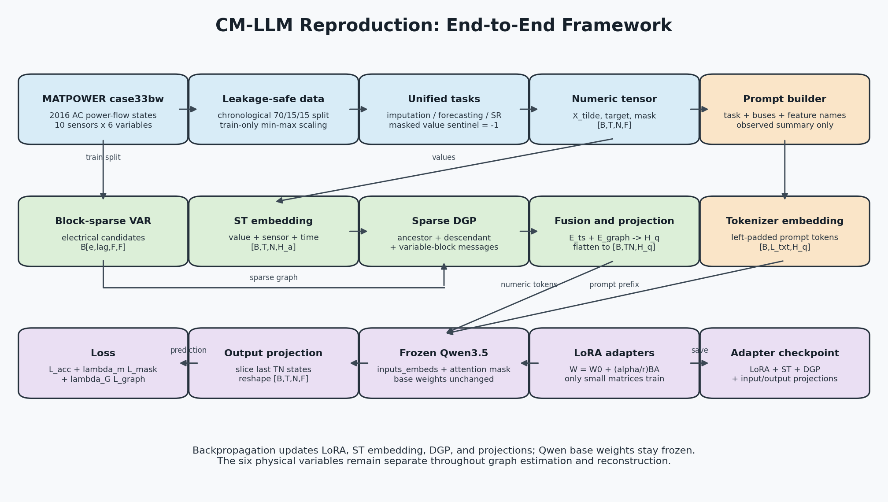
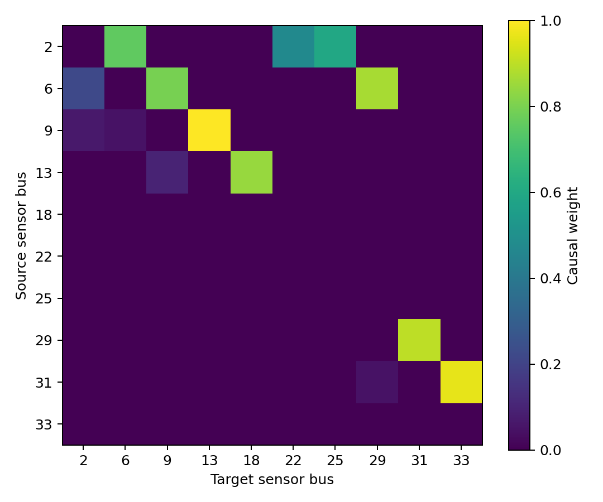
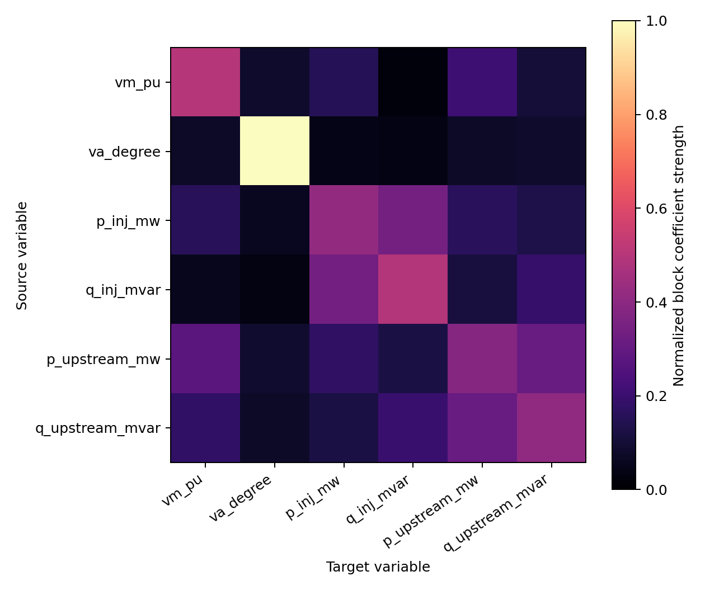
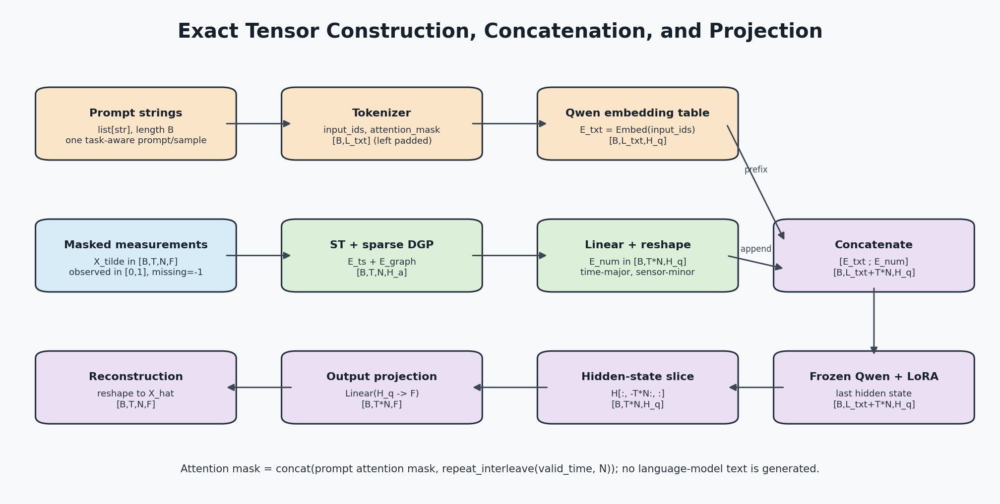
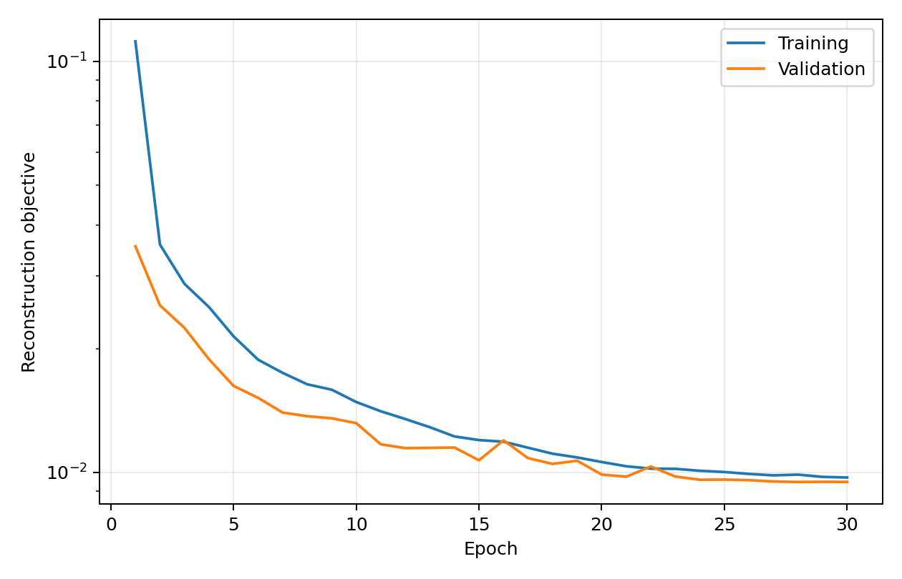

# case33bw 时空传感器 CM-LLM 完整技术文档

本文档描述当前仓库中已经实现并验证的完整方法。内容以代码实际行为为准，覆盖数据生成、任务构造、块稀疏动态因果图、提示词、数值 token、Qwen3.5、LoRA、输出投影、损失、训练、推理和算例结果。

> 公式兼容性说明：本文统一使用 `$...$` 表示行内公式，使用独立的 `$$...$$` 表示块公式，不再使用部分 Markdown 渲染器不支持的反斜杠方括号或反斜杠圆括号语法。

## 1. 方法总览



完整数据流可以概括为：

1. MATLAB 调用本地 MATPOWER 8.1，对 `case33bw` 的每一个时刻执行非线性 AC 潮流计算，得到真实可行运行点上的传感器量测。
2. 按时间顺序划分训练、验证和测试集，仅用训练段拟合归一化器和动态因果图，避免未来信息泄漏。
3. 在每个滑动窗口上生成插补、预测、超分辨率三类掩码任务，形成形状为 `[B,T,N,F]` 的数值张量。
4. 不对不同变量求平均。每个传感器保留 $F$ 维随机向量，每条图边保存 `lag x source_feature x target_feature` 的变量关系块。
5. 时空嵌入和稀疏 DGP 产生数值 token；任务提示词经 Qwen tokenizer 和词嵌入层产生文本 token。
6. 文本 token 作为前缀，数值 token 追加其后，一起送入冻结的 Qwen3.5；LoRA 只给 Qwen 的线性层增加低秩可训练增量。
7. 从 Qwen 最后一层隐藏状态中截取最后 $TN$ 个数值位置，线性投影回 $F$ 个量测变量，恢复 `[B,T,N,F]`。
8. 使用全有效区域重构损失、掩码区域损失和可选的块 VAR 结构残差损失训练。

这里的“提示词统计量”只是辅助文本上下文。完整的六变量数值张量始终保留并直接进入神经网络，提示词中的均值绝不用于替代、压缩或平均因果图中的变量。

## 2. 符号与张量约定

| 符号 | 含义 | 当前配置 |
|---|---|---:|
| $B$ | batch 大小 | 2 |
| $T$ | 一个窗口的时间步数 | 48 |
| $N$ | 传感器数量 | 10 |
| $F$ | 每个传感器的变量数量 | 6 |
| $p$ | 块 VAR 滞后阶数 | 2 |
| $d$ | 每个目标传感器的最大电气邻居数 | 4 |
| $H_a$ | 时空适配器隐藏维数 | 256 |
| $H_q$ | Qwen 文本隐藏维数 | 由 Qwen3.5-9B 配置确定 |
| $L_{txt}$ | 一个 batch 左填充后的提示词长度 | 动态 |
| $E$ | 选中的图边数，包含自边 | 当前为 24 |

核心张量：

| 名称 | 形状 | 含义 |
|---|---|---|
| `values` / $\widetilde X$ | `[B,T,N,F]` | 掩码后的归一化输入，缺失值为 `-1` |
| `target` / $X$ | `[B,T,N,F]` | 完整归一化目标 |
| `mask` / $M$ | `[B,T,N,F]` | 1 表示需要重构，0 表示已观测 |
| `valid_time` / $V$ | `[B,T]` | 动态 padding 后有效时间位置 |
| `edge_index` | `[2,E]` | 每列为 `[source,target]` |
| `lag_coefficients` | `[E,p,F,F]` | 有符号变量级滞后关系 |
| `edge_weights` | `[E]` | DGP 隐状态聚合权重 |
| `feature_mean` | `[N,F]` | 图模型训练段的逐传感器逐变量均值 |
| `feature_scale` | `[N,F]` | 图模型训练段的逐传感器逐变量标准差 |

代码采用以下关系方向约定：

$$
\texttt{lag\_coefficients}[e,\tau-1,a,b]
$$

表示边 $e=(i\rightarrow j)$ 上，源传感器 $i$ 的变量 $a$ 在 $t-\tau$ 时刻对目标传感器 $j$ 的变量 $b$ 在 $t$ 时刻的有符号影响。

## 3. MATPOWER 时序样本生成

### 3.1 本地算例与传感器

数据生成器为 `matlab/generate_case33bw_timeseries.m`，MATPOWER 根目录来自配置：

```text
D:/luosipeng/matpower8.1
```

程序加载 `case33bw`，每 15 分钟产生一个运行点，共 2016 个时间步，即 21 天。传感器部署在母线：

```text
[2, 6, 9, 13, 18, 22, 25, 29, 31, 33]
```

每个传感器保留六个不同物理变量：

| 索引 | 名称 | 单位和物理含义 |
|---:|---|---|
| 0 | `vm_pu` | 电压幅值，p.u. |
| 1 | `va_degree` | 电压相角，degree |
| 2 | `p_inj_mw` | 有功注入，MW；负值表示负荷 |
| 3 | `q_inj_mvar` | 无功注入，MVAr；负值表示负荷 |
| 4 | `p_upstream_mw` | 上游入射支路接收端有功，MW |
| 5 | `q_upstream_mvar` | 上游入射支路接收端无功，MVAr |

原始样本张量为：

$$
X^{raw}\in\mathbb R^{2016\times 10\times 6}.
$$

### 3.2 时空相关负荷过程

设 $P_i^0,Q_i^0$ 为 `case33bw` 的基准负荷。局部随机状态满足空间相关 AR(1)：

$$
z(t)=\rho_l z(t-1)+\sqrt{1-\rho_l^2}\,L\epsilon(t),
\qquad \rho_l=0.92,
$$

其中 $\epsilon(t)\sim\mathcal N(0,I)$，$LL^\top=\Sigma$，空间协方差按母线图距离定义为：

$$
\Sigma_{ij}=\exp\left(-\frac{d_{hop}(i,j)}{6}\right)+10^{-6}\mathbf 1(i=j).
$$

系统级随机状态为：

$$
u(t)=\rho_g u(t-1)+\sqrt{1-\rho_g^2}\,\eta(t),
\qquad \rho_g=0.97.
$$

日周期部分为：

$$
d(t)=0.82
+0.16\sin\left(\frac{2\pi(h_t-8)}{24}\right)
+0.06\sin\left(\frac{4\pi(h_t-17)}{24}\right).
$$

有功负荷倍率：

$$
s_i^P(t)=\max\left(0.35,d(t)+0.035u(t)\right)\exp\left(0.08z_i(t)\right).
$$

无功倍率额外包含小幅功率因数扰动：

$$
s_i^Q(t)=s_i^P(t)\max\left(0.8,1+0.025z_i(t)\right).
$$

于是：

$$
P_i(t)=P_i^0s_i^P(t),
\qquad
Q_i(t)=Q_i^0s_i^Q(t).
$$

该过程同时包含公共日周期、系统级随机扰动、单个母线的时间惯性，以及沿配电网络相关的空间扰动。

### 3.3 非线性 AC 潮流

每个时刻都调用 MATPOWER `runpf`，使用 Newton-Raphson 算法求解：

$$
S_i(t)=P_i(t)+\mathrm jQ_i(t)
=V_i(t)\overline{\sum_jY_{ij}V_j(t)}.
$$

只有 `result.success=true` 的时刻进入 Python 数据集。本次 2016 个运行点全部收敛，因此有效样本数仍为 2016。数据不是直接在 Python 中按线性公式伪造，而是从每个已收敛的 `case33bw` 非线性潮流状态提取。

### 3.4 传感器约简拓扑与电气距离

支路阻抗距离定义为：

$$
d_e(i,j)=\sum_{(u,v)\in path(i,j)}\sqrt{r_{uv}^2+x_{uv}^2}.
$$

MATLAB 同时输出 10 个传感器间的电气距离矩阵。传感器约简物理图中，每个传感器连接到通往平衡母线 1 的路径上最近的上游传感器，得到 9 条有向物理边。

## 4. 数据划分、归一化与样本构造

### 4.1 时间顺序划分

数据严格按时间顺序划分，不随机打乱时间边界：

| 数据段 | 时间步数 | 比例 |
|---|---:|---:|
| 训练集 | 1411 | 70% 取整 |
| 验证集 | 302 | 截止累计 85% |
| 测试集 | 303 | 剩余部分 |

因果图和归一化器只使用训练段。验证段和测试段不会参与图估计。

### 4.2 逐传感器逐变量 min-max 归一化

对每个传感器 $i$、变量 $f$，仅在训练时间段上计算：

$$
m_{if}=\min_{t\in\mathcal T_{train}}X^{raw}_{tif},
$$

$$
r_{if}=\max\left(
\max_{t\in\mathcal T_{train}}X^{raw}_{tif}-m_{if},
10^{-8}
\right).
$$

变换为：

$$
X_{tif}=\operatorname{clip}\left(
\frac{X^{raw}_{tif}-m_{if}}{r_{if}},0,1
\right).
$$

这一步解决不同量纲的数值尺度问题，但不混合变量。每个变量有独立的 $m_{if}$ 和 $r_{if}$。评估时用同一组训练统计量逆变换回物理单位。

### 4.3 滑动窗口

默认窗口长度 $T=48$，对应 12 小时；步长为 12，等于 3 小时。每个窗口分别生成三种任务，因此训练集窗口数为 114，对应 342 个训练样本。

单个未组 batch 的样本包含：

```text
values       [T,N,F]  掩码输入
target       [T,N,F]  完整目标
mask         [T,N,F]  任务掩码
task         str      任务名称
valid_length int      有效时间长度
start        int      在当前数据段中的窗口起点
```

### 4.4 统一掩码重构模型

令 $M\in\{0,1\}^{T\times N\times F}$，1 表示需要模型恢复。输入为：

$$
\widetilde X=(1-M)\odot X-M.
$$

由于观测值已经被压缩到 $[0,1]$，`-1` 是无歧义的缺失哨兵。

三类任务如下。

#### 插补

每个传感器独立抽取连续缺失长度：

$$
\ell_i=\operatorname{clip}
\left(\operatorname{round}(\mathcal N(6,2^2)),1,T-1\right).
$$

再均匀抽取起点。一个传感器发生缺测时，其六个同位置量测通道一起被掩码，模拟传感器通信中断。

#### 预测

最后 $H=8$ 个时刻的所有传感器和变量被掩码：

$$
M_{tif}=1,
\qquad t\in\{T-H,\ldots,T-1\}.
$$

#### 超分辨率

降采样因子 $q=3$。只保留 $t=0,3,6,\ldots$ 和窗口最后一个时刻，其余中间时刻全部掩码。

### 4.5 动态 padding

`dynamic_collate` 将 batch 内样本补到最大时间长度 $T_{max}$：

- `values` 的 padding 值为 `-1`；
- `target` 和 `mask` 的 padding 值为 0；
- `valid_time[b,t]=1` 表示该时刻真实存在；
- 当前固定窗口配置下长度均为 48，但该实现允许未来混合不同长度。

## 5. 不平均变量的块稀疏动态因果图

### 5.1 为什么平均不可接受

若把传感器 $i$ 的六变量压成：

$$
y_i(t)=\frac{1}{F}\mathbf 1^\top x_i(t),
$$

则这是从 $\mathbb R^F$ 到 $\mathbb R$ 的秩一投影，至少存在 $F-1$ 维零空间。电压、相角、有功、无功和支路潮流的独立变化可能抵消，而且源变量到目标变量的交叉关系无法再识别。

当前实现将传感器作为拓扑节点，但节点随机变量是完整向量：

$$
x_i(t)=
\begin{bmatrix}
x_{i1}(t)&\cdots&x_{iF}(t)
\end{bmatrix}.
$$

传感器边承载 $F\times F$ 系数块，因此保留变量级关系，同时避免把整个系统展开为 $NF$ 个全连接节点。

### 5.2 图估计前的 z-score

输入因果发现的数据已经做过训练集 min-max 归一化。图估计器再按传感器和变量计算：

$$
\mu_{if}=\frac{1}{T_{tr}}\sum_tX_{tif},
$$

$$
\sigma_{if}=\max\left(
\sqrt{\frac{1}{T_{tr}}\sum_t(X_{tif}-\mu_{if})^2},
10^{-6}
\right),
$$

$$
z_{tif}=\frac{X_{tif}-\mu_{if}}{\sigma_{if}}.
$$

min-max 归一化服务于神经网络输入，z-score 服务于不同变量系数的可比性；两组统计量均只来自训练段。

### 5.3 有界候选源集合

对每个目标传感器 $j$：

1. 始终加入自身 $j$，用于局部多变量时间动态。
2. 强制加入传感器约简物理图中与 $j$ 相邻的传感器。
3. 按电气距离从近到远补充候选，通常最多达到 `max_neighbors=4` 个空间邻居。

因此固定邻居上限时，候选边规模近似为：

$$
|E_c|\le N(d+1).
$$

如果一个节点的强制物理邻居数本身超过 $d$，实现优先保留所有物理邻居，实际候选数可以略超该名义上限。这保证了物理拓扑不会因为规模参数被误删。

### 5.4 变量物理模板

对空间边定义允许关系模板：

$$
M^{phy}\in\{0,1\}^{F\times F}.
$$

代码根据变量名称识别电压、相角、有功注入、无功注入、有功潮流和无功潮流。恒功率注入被视为外生变量，因此远端电压和潮流不能作为它们的原因；注入变量和未知类型仍可解释注入。电压、相角和支路潮流目标对各源类型保持开放。自身块不应用该空间物理模板，以保留完整本地多变量动态。

### 5.5 块 VAR 结构方程

对目标传感器 $j$ 和目标变量 $b$：

$$
z_{j,b}(t)=
\sum_{i\in\mathcal C_j\cup\{j\}}
\sum_{\tau=1}^{p}
\sum_{a=1}^{F}
B_{ij,ab}^{(\tau)}z_{i,a}(t-\tau)
+\epsilon_{j,b}(t).
$$

每条边的块为：

$$
B_{ij}^{(\tau)}\in\mathbb R^{F\times F}.
$$

例如 $B_{ij,3,1}^{(1)}$ 表示源传感器 $i$ 的有功注入在前一时刻对目标传感器 $j$ 当前电压幅值的关系。它与 $B_{ij,1,3}^{(1)}$ 是两个不同参数，绝不会因平均而混合。

### 5.6 设计矩阵

对目标 $j$，候选源按顺序记为 $c_1,\ldots,c_K$。每个源的滞后块为：

$$
X_{c_k}=
\begin{bmatrix}
z_{c_k}(p-1)&\cdots&z_{c_k}(0)\\
z_{c_k}(p)&\cdots&z_{c_k}(1)\\
\vdots&\ddots&\vdots
\end{bmatrix}
\in\mathbb R^{(T_{tr}-p)\times pF}.
$$

完整设计矩阵与响应：

$$
X_j=[X_{c_1}\;X_{c_2}\;\cdots\;X_{c_K}],
\qquad
Y_j=
\begin{bmatrix}
z_j(p)\\z_j(p+1)\\\vdots
\end{bmatrix}.
$$

所以 $X_j\in\mathbb R^{(T_{tr}-p)\times KpF}$，$Y_j\in\mathbb R^{(T_{tr}-p)\times F}$。

### 5.7 Sparse-group VAR 目标

每个目标传感器独立求解：

$$
\min_B
\frac{1}{2(T_{tr}-p)}\lVert Y_j-X_jB\rVert_F^2
+\lambda_g\sum_{i\in\mathcal C_j\cup\{j\}}
\omega_{ij}\lVert B_{ij}\rVert_F
+\lambda_1\lVert B\rVert_1.
$$

其中：

- $B_{ij}$ 包含该源传感器的全部 $pF^2$ 个滞后变量系数；
- 组 Frobenius 惩罚删除整条传感器边；
- L1 惩罚删除边块内部的具体变量对；
- 自身块权重 $\omega_{jj}=0$；
- 已知物理方向边的权重为 `physical_penalty_multiplier=0.1`；
- 其他统计候选边权重为 1。

物理模板在每次近端更新时逐元素乘到空间边块上，禁止的关系始终为零。

### 5.8 近端梯度求解

光滑项梯度：

$$
\nabla f(B)=\frac{X_j^\top(X_jB-Y_j)}{T_{tr}-p}.
$$

Lipschitz 常数：

$$
L=\frac{\lVert X_j\rVert_2^2}{T_{tr}-p}.
$$

代码用 30 次幂迭代估计 $L$，取步长 $\eta=1/L$。一次迭代为：

$$
U=B^{(k)}-\eta\nabla f(B^{(k)}),
$$

$$
\bar U=\operatorname{sign}(U)
\max(|U|-\eta\lambda_1,0),
$$

$$
B_{ij}^{(k+1)}=
\left(
1-\frac{\eta\lambda_g\omega_{ij}}
{\max(\lVert\bar U_{ij}\rVert_F,10^{-12})}
\right)_+\bar U_{ij}.
$$

相对变化小于 $10^{-5}$ 或达到 400 次迭代后停止。不同目标传感器的条件回归相互独立，可通过 `n_jobs` 并行。

### 5.9 边选择和存储

块范数定义为：

$$
s_{ij}=\left(
\sum_{\tau=1}^{p}\lVert B_{ij}^{(\tau)}\rVert_F^2
\right)^{1/2}.
$$

自身边和已知方向的物理边强制保留。统计边仅在 $s_{ij}\ge0.02$ 时保留。空间边的 DGP 权重归一化为：

$$
w_{ij}=\max\left(0.05,
\min\left(1,\frac{s_{ij}}{\max_{u\ne v}s_{uv}}\right)
\right),
$$

自身边权重为 1，但自身边在空间祖先/后代传播时会被排除，只参与块 VAR 变量消息和结构残差。





当前图统计：

| 指标 | 数值 |
|---|---:|
| 传感器 | 10 |
| 每传感器变量 | 6 |
| 滞后阶数 | 2 |
| 自身边 | 10 |
| 物理空间边 | 9 |
| 统计空间边 | 5 |
| 空间边总数 | 14 |
| 总边数（含自身） | 24 |
| 已存块系数 | 1728 |
| 非零变量关系 | 969 |
| 全系统稠密展开关系 | 7200 |

`scripts/export_causal_graph.py` 可把每一个非零变量关系展开为 CSV，字段包含源/目标母线、滞后、源/目标变量、系数和边类型。该展开只用于审计和绘图，不进入训练内存。

## 6. 提示词构造

### 6.1 提示词的作用边界

提示词提供任务语义、数据来源、传感器位置、变量名和观测上下文统计。它不承载完整数值序列，数值序列通过独立的连续嵌入通道送入 Qwen。因此即使提示词包含一个总体均值，也不会导致六个变量在模型中被平均。

### 6.2 统计量如何计算

对每个样本，只选取 `values >= 0` 的观测位置：

$$
\mathcal O=\{\widetilde X_{tif}:\widetilde X_{tif}\ge0\}.
$$

提示词总体均值和标准差为：

$$
\mu_{obs}=\operatorname{mean}(\mathcal O),
\qquad
\sigma_{obs}=\operatorname{std}(\mathcal O).
$$

端点趋势使用首时刻和末时刻各自仍可观测的元素：

$$
\Delta_{end}=
\operatorname{mean}(\mathcal O_{T-1})
-\operatorname{mean}(\mathcal O_0).
$$

若任一端点没有观测值，则趋势置为 0。由于各通道已做逐变量 min-max 归一化，该摘要是无量纲辅助信号；完整变量信息仍存在于 `[B,T,N,F]` 数值张量中。

### 6.3 精确提示词模板

代码实际拼接的模板如下，标点和句序与 `src/cm_llm/prompts.py` 一致：

```text
You are a power-system time-series analyst. Task: {task_text}. Data source: nonlinear AC power-flow samples from MATPOWER case33bw. Sensor buses: {sensor_buses}. Features: {feature_names}. Sensors are spatially coupled by the radial feeder and each sensor is temporally dependent on its own history. Observed normalized statistics: mean={mean:.4f}, std={std:.4f}, endpoint trend={trend:.4f}. Missing entries equal -1. Reconstruct all sensor-feature channels while preserving observed context.
```

任务文本映射：

| 任务键 | `{task_text}` |
|---|---|
| `imputation` | `recover the contiguous missing sensor measurements` |
| `forecasting` | `forecast the masked future sensor measurements` |
| `super_resolution` | `reconstruct intermediate high-resolution measurements` |

从当前数据加载器实际得到的一条预测提示词为：

```text
You are a power-system time-series analyst. Task: forecast the masked future sensor measurements. Data source: nonlinear AC power-flow samples from MATPOWER case33bw. Sensor buses: [2, 6, 9, 13, 18, 22, 25, 29, 31, 33]. Features: ['vm_pu', 'va_degree', 'p_inj_mw', 'q_inj_mvar', 'p_upstream_mw', 'q_upstream_mvar']. Sensors are spatially coupled by the radial feeder and each sensor is temporally dependent on its own history. Observed normalized statistics: mean=0.5920, std=0.1503, endpoint trend=0.0000. Missing entries equal -1. Reconstruct all sensor-feature channels while preserving observed context.
```

## 7. 时空嵌入与稀疏 DGP

### 7.1 时空数值 token

输入 $\widetilde X\in\mathbb R^{B\times T\times N\times F}$。对时间 $t$、传感器 $i$：

$$
e_{bti}^{ts}=
\operatorname{LN}\left(
W_x\widetilde x_{bti}+b_x
+e_i^{sensor}+e_t^{time}
\right).
$$

其中 $W_x\in\mathbb R^{H_a\times F}$，传感器嵌入表大小为 $N\times H_a$，时间嵌入表最大支持 4096 个时间位置。输出：

$$
E^{ts}\in\mathbb R^{B\times T\times N\times H_a}.
$$

这里 `-1` 会经过 `value_projection`，因此网络可以识别缺失哨兵。显式 `mask` 不直接送入模型，而用于损失选择。

### 7.2 块 VAR 变量消息

DGP 用图统计量重新标准化当前输入。观测位置：

$$
\widetilde z_{btif}=
\frac{\widetilde X_{btif}-\mu_{if}}{\sigma_{if}}.
$$

对 `values < 0` 的掩码或 padding 位置，直接令 $\widetilde z=0$，即图 z-score 空间中的训练均值，避免把 `-1` 当作物理量。

边 $e=(i\rightarrow j)$ 的变量消息：

$$
m_{e,b}(t)=
\sum_{\tau=1}^{p}
\sum_{a=1}^{F}
\widetilde z_{b,t-\tau,i,a}
B_{e,\tau,a,b}.
$$

所有指向传感器 $j$ 的边通过 `index_add` 求和：

$$
m_j(t)=\sum_{e:\,target(e)=j}m_e(t).
$$

输出关系特征形状为 `[B,T,N,F]`，再由 $W_r:\mathbb R^F\rightarrow\mathbb R^{H_a}$ 投影。关系特征只注入第一个 DGP 层。

### 7.3 祖先和后代隐藏消息

空间传播排除自身边。对目标节点 $j$ 的归一化祖先消息：

$$
a_j(t)=
\frac{\sum_{i:i\rightarrow j}w_{ij}h_i(t)}
{\max(\sum_{i:i\rightarrow j}w_{ij},10^{-8})}.
$$

后代消息把有向边反向读取，以便一个节点同时感知其下游状态：

$$
d_i(t)=
\frac{\sum_{j:i\rightarrow j}w_{ij}h_j(t)}
{\max(\sum_{j:i\rightarrow j}w_{ij},10^{-8})}.
$$

第一个 DGP 层：

$$
h_i^{(1)}=
\operatorname{LN}\left(
h_i^{(0)}+
\operatorname{Dropout}\left[
\operatorname{GELU}\left(
W_0h_i^{(0)}+W_aa_i^{(0)}+W_dd_i^{(0)}+W_rm_i
\right)
\right]
\right).
$$

后续层采用同一式子但不再加入 $W_rm_i$。默认 DGP 层数为 2。

所有聚合都直接遍历 `edge_index`，不在训练时创建 $N\times N$ 稠密矩阵。

## 8. Qwen 输入拼接、LoRA 与输出投影



### 8.1 数值嵌入融合

DGP 最终输出记为 $E^{graph}$，形状同 $E^{ts}$。实现采用逐元素相加：

$$
E^{fuse}=E^{ts}+E^{graph}.
$$

再投影到 Qwen 隐藏维数：

$$
E^{q}=W_pE^{fuse}+b_p,
\qquad W_p\in\mathbb R^{H_q\times H_a}.
$$

PyTorch `reshape` 按 `[time,sensor]` 的连续内存顺序展开：

$$
E^{num}\in\mathbb R^{B\times (TN)\times H_q}.
$$

token 顺序为：

```text
(t0,sensor0), (t0,sensor1), ..., (t0,sensorN-1),
(t1,sensor0), ..., (tT-1,sensorN-1)
```

### 8.2 文本 token

batch 中的提示词调用 tokenizer：

```python
tokenizer(
    prompts,
    padding=True,
    truncation=True,
    return_tensors="pt",
)
```

Qwen tokenizer 被设置为左侧 padding。得到：

$$
I^{txt},A^{txt}\in\mathbb N^{B\times L_{txt}}.
$$

随后直接调用 Qwen 的输入嵌入表：

$$
E^{txt}=\operatorname{Embed}_{Qwen}(I^{txt})
\in\mathbb R^{B\times L_{txt}\times H_q}.
$$

### 8.3 文本前缀与数值 token 拼接

输入嵌入在序列维拼接：

$$
E^{input}=\operatorname{Concat}_{seq}
\left(E^{txt},E^{num}\right)
\in\mathbb R^{B\times(L_{txt}+TN)\times H_q}.
$$

注意力掩码中，一个有效时间步会扩展为 $N$ 个有效传感器 token：

$$
A^{num}_{b,(tN+i)}=V_{bt}.
$$

完整注意力掩码：

$$
A^{input}=\operatorname{Concat}_{seq}
\left(A^{txt},A^{num}\right)
\in\{0,1\}^{B\times(L_{txt}+TN)}.
$$

### 8.4 Qwen 前向调用

实际调用参数为：

```python
outputs = backbone(
    inputs_embeds=inputs_embeds,
    attention_mask=attention_mask,
    output_hidden_states=True,
    return_dict=True,
    use_cache=False,
)
```

本方法不把连续数值格式化为十进制文本，不调用语言模型的文本生成接口，也不使用 LM head 产生词表概率。Qwen 在这里作为带文本条件的深层因果序列变换器。

由于 Qwen 是 causal LM，一个数值 token 可以看到全部提示词前缀和它之前的数值 token，不能看到序列中位于其后的数值 token。时间优先的展开顺序与预测任务天然一致；对双向插补和超分辨率，这是当前实现的明确限制，理论提升文档给出了双向共享 LoRA 的后续方案。

### 8.5 LoRA 如何改造而不修改基座

加载 Qwen 后，代码先执行：

```python
for parameter in backbone.parameters():
    parameter.requires_grad = False
```

若启用 LoRA，对 PEFT 识别到的所有线性层注入：

$$
W=W_0+\frac{\alpha}{r}BA,
$$

其中：

$$
A\in\mathbb R^{r\times k},
\qquad
B\in\mathbb R^{d_o\times r}.
$$

默认 $r=32$，$\alpha=64$，dropout 为 0.05，`bias="none"`，`target_modules="all-linear"`。$W_0$ 永远冻结，梯度只更新 $A$、$B$。训练还启用非重入梯度检查点并关闭 KV cache，以减少长数值序列的显存占用。

除 LoRA 外，以下新模块正常训练：

- `SpatioTemporalEmbedding`；
- 两层 `DenseGraphPropagation`；
- `to_llm: H_a -> H_q`；
- `output_projection: H_q -> F`。

Qwen3.5-9B 实际加载检查结果：

| 项目 | 数值 |
|---|---:|
| 模型总参数 | 9,512,911,030 |
| 可训练参数 | 103,097,286 |
| 可训练比例 | 1.0838% |
| 非 LoRA 的可训练 Qwen 基座参数 | 0 |
| 短序列反向中有梯度的 LoRA 张量 | 496 |

这里的可训练参数总数还包含时空嵌入、DGP 和输入输出投影，不仅是 LoRA。

### 8.6 隐藏状态切片与输出投影

Qwen 最后一层隐藏状态：

$$
H^{last}\in\mathbb R^{B\times(L_{txt}+TN)\times H_q}.
$$

文本位于前缀，数值 token 固定位于最后 $TN$ 个位置，因此切片：

$$
H^{num}=H^{last}_{:,-TN:,:}
\in\mathbb R^{B\times TN\times H_q}.
$$

逐 token 线性投影：

$$
Y^{flat}=H^{num}W_o^\top+b_o,
\qquad W_o\in\mathbb R^{F\times H_q}.
$$

最后按与输入相同的时间优先顺序恢复：

$$
\widehat X=\operatorname{reshape}(Y^{flat})
\in\mathbb R^{B\times T\times N\times F}.
$$

输出层不施加 sigmoid，因此训练初期预测可能超出 $[0,1]$；评估时直接逆归一化。当前实现依靠损失学习范围，没有显式物理边界裁剪。

## 9. 损失函数

### 9.1 全有效区域重构损失

令 $V_{bt}$ 为有效时间掩码，并广播到 $N,F$：

$$
\mathcal L_{acc}=
\frac{
\sum_{btif}V_{bt}(\widehat X_{btif}-X_{btif})^2
}{
\max(\sum_{btif}V_{bt},1)
}.
$$

该项同时约束已观测位置和被掩码位置，使模型不要破坏上下文。

### 9.2 掩码区域损失

$$
\mathcal L_{mask}=
\frac{
\sum_{btif}V_{bt}M_{btif}(\widehat X_{btif}-X_{btif})^2
}{
\max(\sum_{btif}V_{bt}M_{btif},1)
}.
$$

掩码位置同时出现在 $\mathcal L_{acc}$ 和 $\mathcal L_{mask}$ 中，因此被额外强调。默认 $\lambda_m=1$。

### 9.3 块 VAR 结构残差

对任意完整序列 $Y$，先用因果图统计量标准化为 $z(Y)$，再定义：

$$
R_G(Y)_{j,b}(t)=z(Y)_{j,b}(t)
-\sum_{i\rightarrow j}
\sum_{\tau=1}^{p}
\sum_{a=1}^{F}
B_{ij,ab}^{(\tau)}z(Y)_{i,a}(t-\tau).
$$

代码不直接最小化 $\lVert R_G(\widehat X)\rVert^2$，而是比较预测与真实序列的结构残差：

$$
\mathcal L_G=
\operatorname{Mean}_{V,\,t\ge p}
\left[
\left\lVert
R_G(\widehat X)-R_G(X)
\right\rVert_2^2
\right].
$$

因此当 $\widehat X=X$ 时，$\mathcal L_G=0$。它只约束重构误差不要违反已学习的变量传播结构，不会迫使真实量测比其本身更符合近似 VAR。

### 9.4 完整目标

$$
\mathcal L=
\mathcal L_{acc}
+\lambda_m\mathcal L_{mask}
+\lambda_G\mathcal L_G.
$$

默认配置 $\lambda_G=0$，严格恢复基础重构目标；`configs/improved.json` 使用 $\lambda_G=0.005$。

## 10. 完整训练流程

### 10.1 训练伪代码

```text
输入：case33bw_timeseries.mat、配置、Qwen3.5 本地权重

1. 读取所有收敛样本
2. 按时间划分 train / validation / test
3. 仅用 train 拟合逐传感器逐变量 min-max 归一化器
4. 仅用归一化后的 train：
   4.1 建立电气距离候选集合
   4.2 为每个目标传感器拟合 sparse-group block VAR
   4.3 保存 edge_index、edge_weights、B[e,lag,F,F]
5. 构造三类滑动窗口数据集和 DataLoader
6. 加载 Qwen，冻结全部原始权重，按配置注入 LoRA
7. 创建时空嵌入、DGP、to_llm、output_projection
8. 对每个 epoch：
   8.1 对每个 batch 生成动态提示词
   8.2 计算时空嵌入和块图消息
   8.3 将提示词嵌入与数值 token 拼接
   8.4 Qwen 前向，截取最后 T*N 个隐藏状态
   8.5 投影为 [B,T,N,F]
   8.6 计算 L_acc、L_mask 和可选 L_G
   8.7 反向传播，只更新 requires_grad=True 的参数
   8.8 梯度范数裁剪到 1.0，AdamW 更新
   8.9 epoch 末执行验证并更新 cosine scheduler
9. 仅保存可训练参数、图、归一化器和配置
```

### 10.2 优化器与调度器

| 参数 | 值 |
|---|---:|
| 优化器 | AdamW |
| 学习率 | $10^{-4}$ |
| weight decay | 0.01 |
| epoch | 50 |
| 梯度裁剪 | 1.0 |
| 调度器 | CosineAnnealingLR |
| 混合精度 | CUDA 上 bfloat16 autocast |

优化器只接收 `requires_grad=True` 的参数。验证阶段使用 `torch.inference_mode()`。

### 10.3 检查点内容

`adapter_checkpoint.pt` 不保存冻结的 Qwen 基座权重，包含：

- 所有可训练参数的 state dict；
- 传感器邻接、稀疏边索引、边权重；
- `[E,p,F,F]` 块系数和边类型；
- 图 z-score 统计量；
- min-max 归一化统计量；
- 完整配置。

冻结的 Qwen 由本地部署重新加载，再以 `strict=False` 加载 adapter checkpoint。

## 11. 推理与评估流程

推理时重新按配置构建数据划分和图，加载同一 Qwen 基座与训练参数，然后对测试窗口执行相同的提示词、数值 token 和投影流程。预测及目标都用训练归一化器逆变换到物理单位。

指标只在 `mask==1` 的待重构区域计算：

$$
\operatorname{MAE}=
\frac{1}{|\Omega_M|}
\sum_{(t,i,f)\in\Omega_M}
|\widehat X^{raw}_{tif}-X^{raw}_{tif}|,
$$

$$
\operatorname{RMSE}=
\sqrt{
\frac{1}{|\Omega_M|}
\sum_{(t,i,f)\in\Omega_M}
(\widehat X^{raw}_{tif}-X^{raw}_{tif})^2
}.
$$

经典基线分别为时间插值、持久性预测和低分辨率插值，具体实现在 `src/cm_llm/baselines.py`。

## 12. 算例结果与分析

### 12.1 数据和图检查

| 项目 | 实测结果 |
|---|---:|
| MATPOWER 样本 | 2016 |
| AC 潮流收敛率 | 100% |
| 数据形状 | `2016 x 10 x 6` |
| 母线 2 电压一阶相关 | 0.98699 |
| 母线 2/6 电压空间相关 | 0.99048 |
| 自动化测试 | 6/6 通过 |

高时间相关和高邻近空间相关说明样本确实具有时空耦合性，不是独立同分布点集。

### 12.2 块图轻量回归实验

轻量随机骨干实验用于快速比较图方法，不代表 Qwen3.5-9B 完整 50 epoch 的最终精度。相同数据、掩码、训练预算和随机种子下，新块图验证损失为 `0.00948`，旧变量平均图为 `0.01197`，下降约 20.8%。



| 任务 | 旧平均图 MAE | 新块图 MAE | 降幅 |
|---|---:|---:|---:|
| 插补 | 0.015241 | 0.013318 | 12.6% |
| 预测 | 0.019001 | 0.018344 | 3.5% |
| 超分辨率 | 0.014251 | 0.011918 | 16.4% |

这组对照直接支持用户提出的判断：变量平均会损失对重构有用的交叉变量信息。

### 12.3 新块图完整评估

| 任务 | 模型 MAE | 模型 RMSE | 经典基线 MAE | 经典基线 RMSE | 电压拓扑违例率 |
|---|---:|---:|---:|---:|---:|
| 插补 | 0.013318 | 0.030215 | 0.009503 | 0.021052 | 0.002946 |
| 预测 | 0.018344 | 0.040557 | 0.020104 | 0.045994 | 0 |
| 超分辨率 | 0.011918 | 0.026973 | 0.006333 | 0.014392 | 0.000105 |

MATPOWER 生成的曲线较平滑，因此线性插值在插补和超分辨率上是很强的基线。模型在预测任务上优于持久性基线。不能仅凭插补和超分辨率结果宣称模型全面优于经典方法。

### 12.4 结构残差对照

| 任务 | 块图 MAE | 块图 + 结构残差 MAE | 相对变化 |
|---|---:|---:|---:|
| 插补 | 0.013318 | 0.013205 | 改善约 0.84% |
| 预测 | 0.018344 | 0.018259 | 改善约 0.46% |
| 超分辨率 | 0.011918 | 0.011904 | 改善约 0.11% |

结构残差带来小幅一致改善，但幅度有限，应视为可调弱先验，而不是主要性能来源。

## 13. 大规模配电系统复杂度

若把所有 `(sensor,feature)` 完全展开并建立稠密 $p$ 阶关系，需要：

$$
O(N^2pF^2)
$$

个候选系数。块稀疏方案只对每个目标保留至多 $d$ 个空间邻居和一个自身块：

$$
O(N(d+1)pF^2).
$$

两者理论比例：

$$
\frac{N^2pF^2}{N(d+1)pF^2}
=\frac{N}{d+1}.
$$

例如 $N=1000,F=6,p=2,d=4$：

| 方案 | 候选系数 |
|---|---:|
| 全展开稠密图 | 72,000,000 |
| 有界块候选图 | 360,000 |

理论候选规模减少 200 倍。目标传感器回归可以并行，DGP 的隐藏传播复杂度为 $O(BTEH_a)$，变量块消息复杂度为 $O(BTEpF^2)$，都随实际边数线性增长。

100 传感器烟雾实验结果：

| 指标 | 数值 |
|---|---:|
| 传感器 | 100 |
| 空间边 | 395 |
| 保存候选系数 | 35,640 |
| 稠密展开系数 | 720,000 |
| 存储缩减 | 20.2 倍 |
| 4 CPU 线程耗时 | 约 0.65 秒 |

## 14. 代码路径对照

| 技术环节 | 实现文件 | 关键入口 |
|---|---|---|
| MATPOWER AC 潮流 | `matlab/generate_case33bw_timeseries.m` | `generate_case33bw_timeseries` |
| Python 启动 MATLAB | `scripts/generate_data.py` | `main` |
| 数据读取与归一化 | `src/cm_llm/data/dataset.py` | `load_case33bw_mat`, `SensorStandardizer` |
| 三类任务掩码 | `src/cm_llm/data/masking.py` | `build_mask`, `apply_mask` |
| 时间划分与 DataLoader | `src/cm_llm/training.py` | `prepare_experiment_data` |
| 块稀疏因果图 | `src/cm_llm/causal.py` | `discover_causal_graph` |
| 提示词 | `src/cm_llm/prompts.py` | `build_prompts` |
| 变量块 DGP | `src/cm_llm/model/dgp.py` | `DenseGraphPropagation` |
| Qwen/LoRA/投影 | `src/cm_llm/model/cmllm.py` | `load_qwen_backbone`, `CMLLM` |
| 损失 | `src/cm_llm/losses.py` | `ReconstructionLoss` |
| 训练 | `scripts/train.py` | `main` |
| 评估 | `scripts/evaluate.py` | `main` |
| 图导出 | `scripts/export_causal_graph.py` | `main` |
| 文档图生成 | `scripts/generate_doc_diagrams.py` | `main` |

## 15. 复现命令

```powershell
$python = 'D:\Conda\envs\power_llm\python.exe'

& $python scripts\generate_data.py --config configs\default.json
& $python scripts\preflight.py --config configs\default.json
& $python scripts\export_causal_graph.py --config configs\default.json
& $python scripts\generate_doc_diagrams.py
& $python -m unittest discover -s tests -v
```

Qwen LoRA 训练：

```powershell
& $python scripts\train.py --config configs\default.json --backbone qwen
```

结构残差版本：

```powershell
& $python scripts\train.py --config configs\improved.json --backbone qwen
```

评估：

```powershell
& $python scripts\evaluate.py `
  --config configs\default.json `
  --checkpoint outputs\default\adapter_checkpoint.pt `
  --backbone qwen
```

## 16. 已知限制

1. 统计边是给定候选集和已观测变量条件下的滞后预测关系，不能无条件解释为干预因果；天气、调度和区域负荷等未观测公共因素仍可能造成混杂。
2. Qwen 保持 causal attention。预测任务方向合理，但单向序列限制了插补和超分辨率利用右侧上下文的能力。
3. 提示词统计是跨归一化通道的全局摘要，虽然不丢失主数值通道信息，但表达能力有限，后续可以改为逐变量统计 token。
4. 当前图一次离线估计后固定，不能自动适应拓扑切换、故障隔离或长期分布漂移。
5. 输出没有显式电压上下界、潮流方程投影或可行域校正；目前只通过数据和弱结构损失间接学习物理规律。
6. 本轮已经验证本地 Qwen 前向和 LoRA 反向，但尚未执行 Qwen3.5-9B 完整 50 epoch 长训练，因此文档没有虚构 9B 的最终 MAE。

这些限制及其严格理论改进方案见 [理论提升文档](theoretical_improvements.md)。
